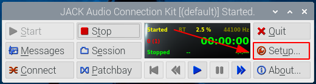
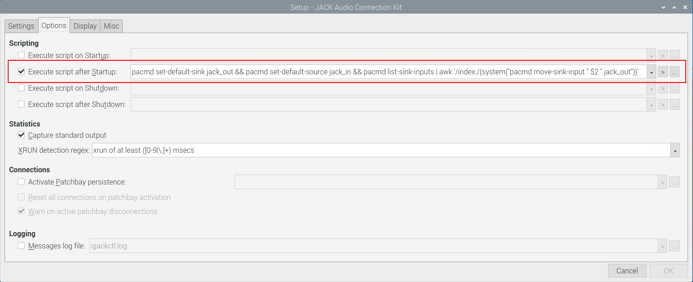

<!-- omit in toc -->
# Audio

## Table of Contents

- [Table of Contents](#table-of-contents)
- [Make jack and pulseaudio coexists](#make-jack-and-pulseaudio-coexists)
  - [Configure jackd](#configure-jackd)
  - [Configure qjackctl](#configure-qjackctl)
- [Digital Audio Workstation](#digital-audio-workstation)
  - [Repear](#repear)

## Make jack and pulseaudio coexists

I took inspiration from https://askubuntu.com/questions/572120/how-to-use-jack-and-pulseaudio-alsa-at-the-same-time-on-the-same-audio-device
and https://madskjeldgaard.dk/posts/raspi4-notes/ and I want to sum it up here what to do to have everything working.

### Configure jackd

First we need to know the name of the sound card we want to use with jackd and to
do it I will use the already present command `aplay -l`.

```sh
raspberrypi :: ~ » aplay -l | awk '/card/{print $3}'
b1
Headphones
```

I want to use my HDMI port as output for jack so i need to use `b1` as device

```sh
sudo apt install pavucontrol jackd2 pulseaudio-module-jack
echo "/usr/bin/pasuspender -- jackd -P75 -dalsa -dhw:b1 -r44100 -p512 -n3" | tee -a ~/.jackdrc
```

### Configure qjackctl

1. open `qjackctl` and click to `Setup` button

2. click on `Options` tab and add into `Executable script after Startup` the following command:

```sh
pacmd set-default-sink jack_out && pacmd set-default-source jack_in && pacmd list-sink-inputs | awk '/index:/{system("pacmd move-sink-input " $2 " jack_out")}'
```


This command will instruct pulseaudio to use jack as input and output and also redirect the playing application to jack_out

3. click on `Misc` tab and make sure that the following items are selected:
  - Start JACK audio server on application startup;
  - Enable system try icon;
  - Start minimized to system try;
  - Enable D-Bus interface;
  - Enable JACK D-Bus interface;
  - Stop JACK audio server on application exit.


## Digital Audio Workstation

### Repear

[Reaper documentation](./Reaper.md)